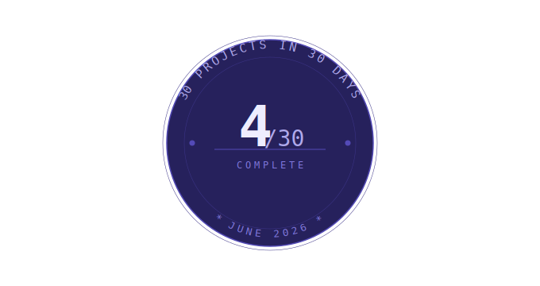

<table><tr>
<td></td>
<td><h1>Day 4/30 — Generative ASCII Art (Perlin Noise)</h1></td>
</tr></table>

## About
A terminal-based generative art engine that renders landscapes as ASCII characters using a from-scratch implementation of Perlin noise — no libraries, just raw math. Numeric noise values are mapped to a character ramp from sparse (` .:-`) to dense (`*#%@`), producing smooth organic terrain that looks different every run.

## How It Works

### `fade_curve(t)`
Applies Ken Perlin's quintic smoothing polynomial `6t⁵ - 15t⁴ + 10t³` to a value, producing smooth S-curve transitions between grid points instead of harsh linear jumps.

### `lerp(a, b, t)`
Standard linear interpolation — blends two values `a` and `b` by a factor `t`, used to smoothly combine gradient contributions from neighboring grid corners.

### `gradient_function(hash, x, y)`
Given a hashed corner value and a distance vector, picks one of four gradient directions and returns the dot product — this is what gives each region of the noise field its unique directional character.

### `twodnoise(x, y)`
Core 2D Perlin noise implementation — finds the four surrounding grid corners, hashes them through the permutation table, computes gradient dot products at each corner, and interpolates the results using the fade curve.

### `FBM(x, y)`
Fractional Brownian Motion — stacks multiple octaves of `twodnoise` together, each one doubling the frequency and halving the amplitude, producing layered terrain with both large rolling hills and fine surface detail.

### `terrain_generation(offset)`
Loops through every cell of the display grid, samples `FBM` at each position, normalizes the result to `0–1`, and maps it to the ASCII character ramp. The `offset` parameter shifts the sample position each frame to produce animation.

## Character Ramp
```
" .:-=+*#%@"  →  low density to high density  →  valleys to peaks
```
